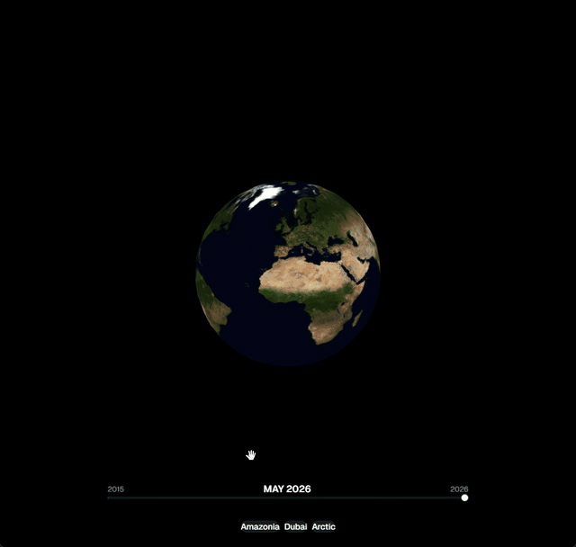
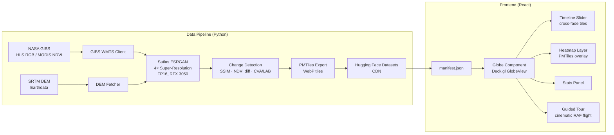

# TerraLens

> **Interactive 3D explorer of Earth's surface changes** — fly from the Amazon to Dubai to the Arctic and watch a decade of satellite data unfold in 10 seconds.


---



## Live Demo

🌍 **[terra-lens-zeta.vercel.app](https://terra-lens-zeta.vercel.app)**

---

## What it does

TerraLens processes 10 years of NASA satellite imagery (2015–2024) through an AI super-resolution pipeline and change detection algorithms, then serves the results as an interactive 3D globe with a cinematic guided tour.

**Key features:**
- Cinematic 10-second hook: globe → Amazonia → Dubai → Arctic, fully automated
- SSIM, NDVI delta, and CVA heatmap overlays — toggle between change metrics
- Timeline slider with cross-fade between monthly snapshots
- Stats panel showing vegetation loss, urban expansion, and ice coverage percentages
- 30fps mobile optimization with graceful fallback

---

## Architecture



---

## Tech Stack

| Layer | Technology |
|-------|-----------|
| 3D Globe | Deck.gl GlobeView + BitmapLayer / TileLayer |
| Frontend | React 19 · TypeScript 6 · Tailwind · shadcn/ui |
| Animation | Custom RAF + quadratic Bezier zoom arc (no DeckGL interpolator) |
| AI Upscaling | Satlas ESRGAN 4× (PyTorch FP16, tiled 512×512 with overlap blending) |
| Change Detection | scikit-image SSIM · NDVI delta · CVA Euclidean in LAB colorspace |
| Tile Format | PMTiles (raster, WebP quality=85) |
| Data Sources | NASA GIBS WMTS (no auth) · NASA Earthdata SRTM DEM |
| Tile CDN | Hugging Face Datasets (HTTP Range Requests, Cloudflare CDN) |
| Deploy | Vercel (frontend) · Hugging Face Datasets (PMTiles CDN) |
| CLI | Python · Typer · Rich progress bars · SQLite tile cache |

---

## Quick Start

### Prerequisites

- Conda / Miniconda (Python 3.10)
- Node.js 20+
- NVIDIA GPU (RTX 3050+ recommended, 4GB VRAM)
- NASA Earthdata account (free) for DEM data

### 1. Python environment

```bash
conda env create -f environment.yml
conda activate terralens
pip install -e .
```

### 2. Credentials

```bash
cp .env.example .env
# Fill in NASA_EARTHDATA_USER, NASA_EARTHDATA_PASS
# Fill in HF_TOKEN (write token from huggingface.co/settings/tokens)
# Fill in HF_REPO_ID=Piotr1686/terralens-data
```

### 3. Run the data pipeline

```bash
# Fetch + process + export one region (~2-4h per region)
terralens fetch --region amazonia --start-date 2015-01-01 --end-date 2024-12-31 --layer HLS_RGB --frequency monthly
terralens process --region amazonia
terralens export --region amazonia
terralens deploy --region amazonia   # uploads to Hugging Face Datasets CDN
```

### 4. Frontend (dev mode)

```bash
cd frontend
npm install
npm run dev   # http://localhost:5173
```

The frontend works in demo mode using live NASA GIBS tiles without needing local data.

### 5. Frontend (production build)

```bash
cd frontend
npm run build   # output: frontend/dist/
```

---

## Project Structure

```
terralens/
├── src/terralens/
│   ├── cli/           # Typer CLI commands
│   ├── fetchers/      # GIBS WMTS + SRTM DEM clients
│   ├── engines/       # Satlas ESRGAN wrapper (FP16 singleton)
│   ├── processors/    # SSIM, NDVI, CVA, cloud masking, histogram matching
│   ├── export/        # PMTiles builder + manifest generator
│   └── db/            # SQLite tile cache
├── frontend/
│   └── src/
│       ├── components/ # Globe, Timeline, HeatmapControls, StatsPanel, GuidedTour, Preloader
│       └── hooks/      # useCinematicFlight, useRevealOpacity, useHeatmapLayer, useTour, usePreload
├── scripts/           # PoC scripts, smoke test, setup guides
├── tests/             # pytest test suite (130+ tests)
├── docs/              # ADR-001-frontend-engine.md
├── vercel.json
├── environment.yml
└── pyproject.toml
```

---

## Hardware Targets

Pipeline tested on **RTX 3050 Laptop 4GB VRAM**:
- Peak VRAM: ~550MB (Satlas ESRGAN FP16, tiled 512×512)
- Processing time: ~45 min/region for 10 years of monthly snapshots
- Total pipeline (3 regions): ~8-12h overnight run

---

## Related Projects

- [NeuroMosaic](https://github.com/Piotr1686/neuromosaic) — neural architecture search explorer

---

## License

MIT © Piotr Łazowski
